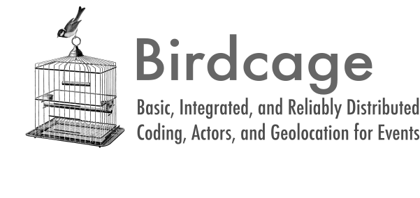

# birdcage



Quickly produce Petrarch-coded event data from a database of CoreNLP-processed
text.

Birdcage fits within an ecosystem of Open Event Data Alliance tools for
producing political event data from text at scale.

The overall process of producing event data with the OEDA tools consists of three steps:

1. parsing text using CoreNLP
2. extracting and coding actors and events using an event coder like [Petrarch2](https://github.com/openeventdata/petrarch2)
3. postprocessing, including enhancing with geolocation information and
   formatting the event

The code in this repo performs steps 2 and 3. It takes in documents that have
been processed by CoreNLP using our distributed processing code,
[biryani](https://github.com/oudalab/biryani) and produces final event data
from it. *The code assumes you have produced CoreNLP-type parses using
biryani*.

Tools for making a small amount of event data (from less than, say, a half
million articles) can use a well tested and reliable set of 2014-era tools
provided by the Open Event Data Alliance. The process of producing event data
with those tools is documented in a [blog
post](https://andrewhalterman.com/2017/05/08/making-event-data-from-scratch-a-step-by-step-guide/). 

For larger collections of text, these existing tools are too slow to be
feasible. For instance, in processing a collection of historical news text, we
needed to parse and code around 300 million news stories, which was simply not
feasible with single-machine techniques. birdcage uses GNU parallel to
distribue the processing task across cores on a machine and across machines in
a cluster.

# Dependencies

You should have the following installed (installed by default in most Linux
systems).

- GNU Parallel
- sqlite3 # (with json support)
- python3.6 # or greater
- pip3 # apt install python3-pip

Next, install the Python packages required, which includes Petrarch2.

```
pip3 install --upgrade pip3
pip3 instal --user -r requirements.txt
```

Finally, install some required utlities. The first line may be omitted if
you're not experimenting on the speed of the system.

```
sudo apt install speedtest-cli iperf
sudo apt install jq
```

# Setup


Be sure to add a `myservers` file in the same directory. This file should list
`:` and the IP address of every other remote server. You will need passwordless
(i.e. public key) access to each server. [More information
here](https://www.gnu.org/software/parallel/man.html#EXAMPLE:-Using-remote-computers).

```
echo ":" > myservers
```

If you'd like to perform geolocation on your events, make sure
[Mordecai](https://github.com/openeventdata/mordecai) is running and
accessible. Then, inside `PhoenixConverter.py`, set `GEOLOCATION = True`.


# Execution

Birdcage has example scripts to run the pipeline.
The `RUN_ALL.sh` file runs the pipeline overall database input using bash.

This file contains several steps:

First, it defines a variable `dbfiles`, which is a list of the location of all the
Petrarch-encoded database files. In this example all the files are local to the
filesystem.

Next, a bash function called `myrun` is created. The `myrun` function takes one
parameter (the file to be processed). The function creates an output file the
in the `outfile/` directory. You should ensure that this file exists. This
function then runs the main processing line.

```bash

nice -n19 \
    sqlite3 $item "select json_object('doc_id', doc_id, 'phrases', phrases, 'mongo_id', mongo_id, 'date', date) from petrarch_table" |\
    parallel --no-notice --jobs +0 --pipe "python3 birdcage.py --data '-' \
    >> $outfile"
```

The first line, `nice -n19` gives this script low priority in the list of
running tasks. This is an IO-bound tasks so it is best to not also dominate the
cores. Next, sqlite3 extracts the data from the petrarch tables in the database
file. The file was passed in as a parameter. They query constructs a json
object for each returned row. A list of json objects is passed, via pipes, to
`gnu parallel`. Then parallel runs `birdcage.py` on the sets of json rows, with each
run of birdcage taking a chunk of data from each process. The result events
are written to std out and then to the declared outfile.

This process is looped over for each file in the `dbfiles` list. 

# Acknowledgement 

birdcage makes extensive use of [GNU Parallel](https://www.gnu.org/software/parallel/). Below is the .bib citation.

```latex
@book{ole2018gnu,
      author       = {Tange, Ole},
      title        = {GNU Parallel 2018},
      publisher    = {Ole Tange},
      month        = Mar,
      year         = 2018,
      ISBN         = {9781387509881},
      doi          = {10.5281/zenodo.1146014},
      url          = {https://doi.org/10.5281/zenodo.1146014}
}
```
